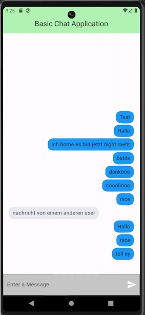

# fb_chat_example

A small chat app showing how to use firebase and firestore.
This branch is an example for the usage of security rules.

## Setup
In order to use it, you need to connect a firebase project to the app. You can do this by following the instructions on the [firebase console](https://console.firebase.google.com/).

In short, run the following commands in the terminal:

```bash
flutterfire configure --project=<firebase-project-name>
```

## Usage

You can log in with different users and then each user can send messages to a shared chat.


## Security Rules

The following security rules could be added:

```javascript
rules_version = '2';

service cloud.firestore {
  match /databases/{database}/documents {
  	// If the users is logged in, 
    match /messages/{documentId} {
      allow read: if request.auth != null;
      allow write: if request.auth != null &&
        request.resource.data.messageSenderName == request.auth.token.email;
    }
  }
}
```

## Screenshot
